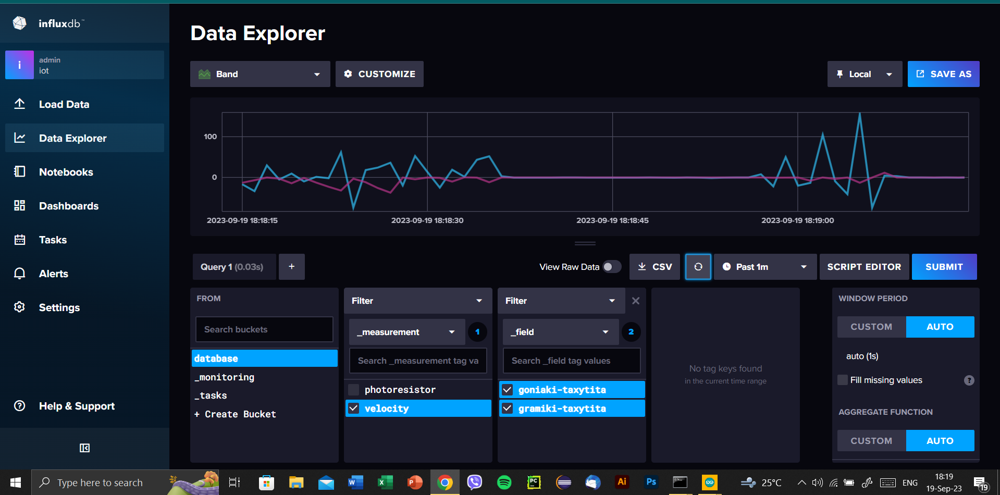
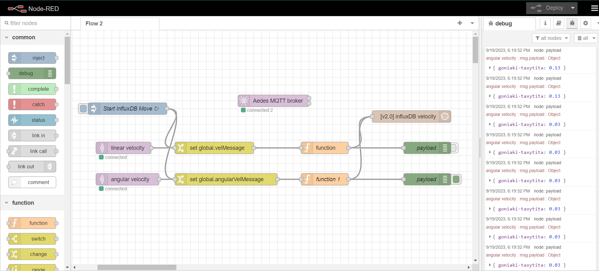
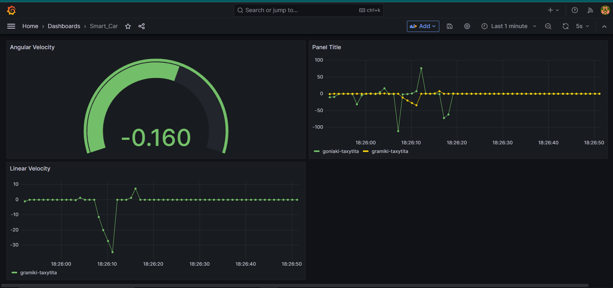
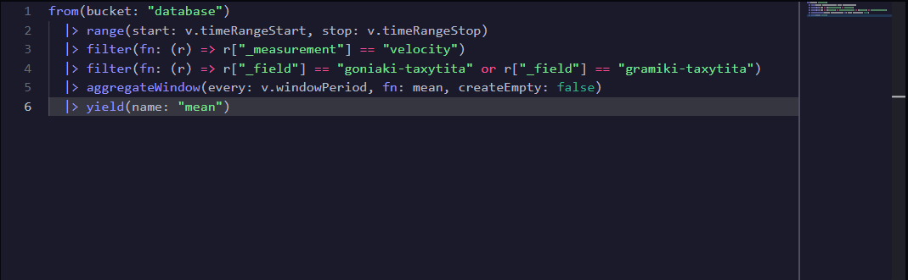

# Smart Car IoT Project

# Introduction

Welcome to our Smart Car IoT project repository! This project aims to provide an educational exploration of applied IoT (Internet of Things) technologies, focusing on microcontrollers such as Arduino and ESP32. By leveraging various sensors and connectivity options, we endeavor to create smart gadgets that can make measurements, send data to the internet, and be controlled remotely.

In this project, we specifically delve into the development of a smart car prototype. This smart car incorporates sensors for control, measurements, and data transmission capabilities to the internet. By utilizing both Arduino and ESP32 microcontrollers, we can harness their distinct capabilities to enhance the functionality of our smart car.

# Project Components

Hardware:
Arduino Uno (or compatible)
ESP32 module
Motors and motor driver
Ultrasonic sensor (for distance measurement)
Camera module (for visual data)
Other sensors as desired
Software:
Arduino IDE
PlatformIO (optional, for ESP32 development)

# Libraries used
  -- ArduinoFFT
  -- Arduino-MPU6050
  -- DabbleESP32
  -- movingAvg-2.3.1
  -- pubsubclient
  -- ServoTimer2

# Project Setup

Hardware Assembly: Connect the various components according to the provided schematics. Ensure proper wiring and connections to avoid any issues during testing.
Software Installation:
Install Arduino IDE on your development machine.
Optionally, install PlatformIO for ESP32 development if preferred.
Download and install any required libraries for sensor interfacing and internet connectivity.
Code Configuration: Open the Arduino IDE or PlatformIO, depending on your preference, and load the provided project code.
Upload Firmware: Compile and upload the firmware to the respective microcontrollers (Arduino Uno and ESP32).
Testing: Power on the smart car and test its functionalities, including sensor readings, data transmission, and remote control capabilities.
Project Features
Sensor Integration: Utilize various sensors such as ultrasonic sensors for distance measurement, camera modules for visual data, etc., to enable smart functionalities.
Data Transmission: Implement protocols for transmitting sensor data to the internet, allowing for remote monitoring and analysis.
Remote Control: Enable remote control capabilities, allowing users to interact with the smart car from anywhere with an internet connection.
Expandability: The project is designed to be expandable, allowing for the integration of additional sensors and functionalities as desired.
Contributing
We welcome contributions from the community to enhance this project further. Whether it's improving code efficiency, adding new features, or suggesting enhancements, your contributions are valuable. Please follow the guidelines outlined in the CONTRIBUTING.md file for submitting pull requests.

# License
This project is licensed under the MIT License, allowing for free use, modification, and distribution of the codebase.

# Acknowledgments
We would like to thank the open-source community for their contributions and the creators of various libraries and tools used in this project.

# Contact
For any inquiries or feedback, please contact mth295@edu.hmu.gr

-- Vardis Daskalakis, Michalis Xyrakis

 
 

 # References

[1] https://playground.arduino.cc/Main/CapacitiveSensor/
[2] https://makeabilitylab.github.io/physcomp/advancedio/smoothing-input.html
[3] https://www.youtube.com/watch?v=40TjjWLljaU&list=LL&index=3&t=1133s
[4] http://highlowtech.org/?p=1963
[5] https://projecthub.arduino.cc/ashraf_minhaj/how-to-use-servotimer2-library-simple-explain-servo-sweep-9bbe4e
[6] https://ai.thestempedia.com/docs/dabble-app/getting-started-with-dabble/
Figure 15. Part of the Esp32 code, which measures cosine similarity and performs classification.
[7] https://eloquentarduino.github.io/2019/12/word-classification-using-arduino/
[8]https://www.youtube.com/watch?v=qeqfoGQs9yo&list=PL9llF8o97zIx1VGLLm1Nk8-qVPAHvWvB7&index=2
[9] https://www.youtube.com/watch?v=Mgh2WblO5_c
[10] https://www.youtube.com/watch?v=hnxYPTehBMk
[11] https://github.com/nathaniel-johnston/arduino-fft
[12] https://eloquentarduino.com/libraries/micromlgen/
 
